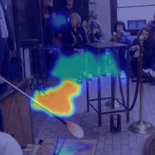
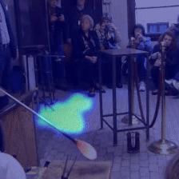
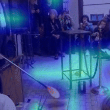
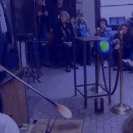
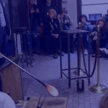

# revex_framework


This project contains the implementation of REVEX (REmoval-based Video EXplanations), a unified framework for removal-based explanations in the video domain. By decomposing explanation into manageable steps, REVEX facilitates the study of each step's impact and allow for further refinement of explanation methods. 

Additionally, six existing explanation techniques are adapted to video data by incorporating temporal information and enabling local explanations. The project also provides implementation for evaluation metrics commonly used for eXplainable AI (XAI) methods.

<div style="align-items: end; width: 100%; display: flex; flex-direction: row; justify-content: center;">
    <p style="text-align: center; width: 14%;"><b>Input video</b></p>
    <p style="text-align: center; width: 14%;"><b>Video LIME</b></p>
    <p style="text-align: center; width: 14%;"><b>Video Kernel-SHAP</b></p>
    <p style="text-align: center; width: 14%;"><b>Video RISE</b></p>
    <p style="text-align: center; width: 14%;"><b>Vieo LOCO</b></p>
    <p style="text-align: center; width: 14%;"><b>Video UP</b></p>
    <p style="text-align: center; width: 14%;"><b>Video SOS</b></p>
</div>

<div style="width: 100%; display: flex; flex-direction: row; justify-content: center;">
    
    
    
    
    
    
    
</div>


## Install

To install the project, follow these steps:

1. Clone the repository:
    ```sh
    git clone https://github.com/Xavi3398/revex_framework.git
    ```

2. Navigate to the project directory:
    ```sh
    cd revex_framework
    ```

3. Install the required dependencies:
    ```sh
    pip install -r requirements.txt
    ```

## Usage

[basic_usage.ipynb](notebooks/basic_usage.ipynb) offers a brief introduction on how to use the REVEX frameworks to obtain removal-based explanations. You will also find several examples featuring multiple options for the different steps.

The REVEX explanation pipeline consists of four main components:

* [segmenters.py](segmenters.py): Contains various options for video segmentation.
* [perturbers.py](perturbers.py): Provides different methods for perturbing video regions, including feature selection, sample selection, and feature removal. Each perturbation is passed through the network to obtain an associated prediction.
* [explainers.py](explainers.py): Summarizes the data generated from the perturbation step.
* [visualizers.py](visualizers.py): Offers multiple visualization options to enhance the understanding of the explanations.

In the [notebooks](notebooks) directory, you will find examples demonstrating how to use the different options available at each step.

## License

This project is licensed under the MIT License - see the [LICENSE](LICENSE.TXT) file for details.